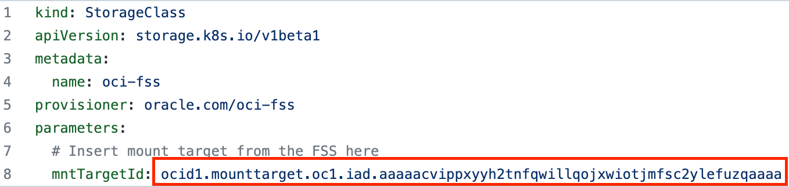
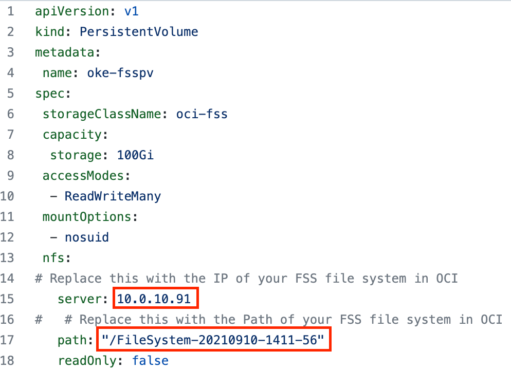

# FSI Monte Carlo Simulator
FSI Monte Carlo simulator is a container based and cloud native solution that allow users to price European Vanilla Options through a Python-C++ wrapper. The solution is completelly compiled and containerized in order to easy the deployment.

## Prerequisites
To deploy the FSI Monte Carlo simulator you need to have an OCI OKE cluster deployed and running within any intel available shape. 

Tested shapes:

    VM.Standard.*
    BM.HPC.*
    
Considering to access the cluster for monitoring, configuring and testing from you laptop, OKE cluster should be deployed within public API endpoint and workers in private mode.

### FSS deployment
To enable the detailed monitoring, you need to set a file system and a mount target created according to the instructions in [Announcing File Storage Service UI 2.0](https://blogs.oracle.com/cloud-infrastructure/post/announcing-file-storage-service-ui-20) and selecting the oke private network.

Set up the security list for the FSS:

Modify the FSS deployment files with your FSS parameters:
* [StorageClass file](ks8-deployment/storageClass.yaml)

* [PersistentVolume file](ks8-deployment/persistentVolume.yaml)

## Deployment
In order to start the deployment, you need to access to the OKE cluster through your Cloud Shell Access and clone the FSI Monte Carlo Simulator github repository and set the permission for the installation script:

    git clone https://github.com/oracle-quickstart/oci-monte-carlo-simulations-FSI.git
    chmod +x oci-monte-carlo-simulations-FSI/install.sh
    cd oci-monte-carlo-simulations-FSI/
    ./install.sh

Please, check that the RabbitMQ host is running accessing through the WEB GUI and mcv-controller and mcv-parent-controller consumers are connected to the tasks_in and tasks_in_splittable queues respectively.

### Access your RabbitMQ Management GUI
Run the next command to list the load balancer service and get the external IP:

    kubectl get services | grep loadbalancer

You can reach the RabbitMQ Management GUI: *loadbalancer_externalip:15672*

### Access your Splunk Management GUI
You can reach the Splunk Management GUI: *loadbalancer_externalip:8000*

#### Create the Splunk dashboard

### Scale workers
By default the instalation is going to deploy 100 mcv-worker pods and 50 mcv-parent pods.
To increase the performance, ensure to set the number of pods according to the number of OCPUs in your node pool. You can scale the number of pods with:

    kubectl scale --replicas=[NUM_OF_REPLICAS] rc/mcv-controller
    kubectl scale --replicas=[NUM_OF_REPLICAS] rc/mcv-parent-controller

## SSH to the client
For testing the simulator, first of all you need to identify the name of the client pod:

    kubectl get pods | grep mcv-client-controller

Once identified the name of the pod, you can access to inside running:

    kubectl exec --stdin --tty [CLIENT_POD_NAME] -- /bin/bash

### Testing
Inside the client pod, you can find different portfolio examples to be used as input files:

* [simulations.json](input-files/simulations.json) --> 2 simple deals
* [simulation_50_simple.json](input-files/simulation_50_simple.json) --> 50 simple deals
* [simulation_1000_simple.json](input-files/simulation_1000_simple.json) --> 1000 simple deals
* [simulation_30000_simple.json](input-files/simulation_30000_simple.json) --> 30000 simple deals
* 
* [simulation_50_complex.json](input-files/simulation_50_complex.json) --> 50 complex deals
* [simulation_250_complex.json](input-files/simulation_250_complex.json) --> 250 complex deals
* [simulation_1000_complex.json](input-files/simulation_1000_complex.json) --> 1000 complex deals
* 
* [simulation_10_mix.json](input-files/simulation_10_mix.json) --> 10 mix deals
* [simulation_50_mix.json](input-files/simulation_50_mix.json) --> 50 mix deals

To run the client and start the calculation:

    python3 main.py [INPUTFILE]

#### Simple or complex deal examples
Simple deal means that number of Monte Carlo simulations will be 3.000.000 or lower and won't be splittable

    {
    "portfolio_id": 1000,
    "parent_id": 0,
    "child_id": 0,
    "level": 0,
    "num_sims": 3000000,
    "underlying": 102,
    "strike": 102,
    "riskfreerate": 0.02,
    "volatility": 0.01,
    "maturity": 1
    }

Complex deal means that number of Monte Carlo simulations will be higher 3.000.000 and will be splittable in N/3.000.000 subdeals to be processed in parallel

    {
    "portfolio_id": 1000,
    "parent_id": 0,
    "child_id": 0,
    "level": 0,
    "num_sims": 12000000,
    "underlying": 98,
    "strike": 98,
    "riskfreerate": 0.03,
    "volatility": 0.02,
    "maturity": 1
    }

## Results
Theroretical time of one simple task (3.000.000 Monte Carlo simulations), based on BM.HPC2.36 shape, takes 0,510ms. Simulator time is 0,517s approx.

## Destroy the simulator
When you no longer need the deployment, you can delete the OKE cluster
